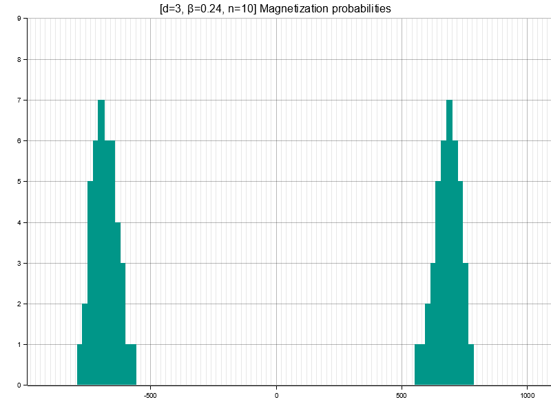

# A simple [Ising model](https://en.wikipedia.org/wiki/Ising_model) simulator

*This project is written in Rust and should be built from sources with Cargo ([see documentation](https://doc.rust-lang.org/cargo/guide/working-on-an-existing-project.html)).*

This project lets you simulate the d-dimensional Ising model in two modes:
- **mcmc**: Computes an approximation of the energy and magnetization distributions using an MCMC cluster algorithm as described in <https://arxiv.org/abs/cond-mat/0311623>. In 2D, it also plots the resulting lattice.
- **exact** (small lattices only): Iterates over all possible states using a [Gray code](https://en.wikipedia.org/wiki/Gray_code) algorithm and plots the exact energy and magnetization distributions.

### Examples

##### 2500x2500 lattice at critical temperature

    ising --beta 0.4407 -n 2500 mcmc --iter 1000

##### Magnetization on a 10x10x10 lattice just below critical temperature

    ising -d 3 --beta 0.24 -n 10 mcmc -i 50000

See [here](./examples/) for more examples, use `ising --help`, `ising mcmc --help`, `ising exact --help` for help.
